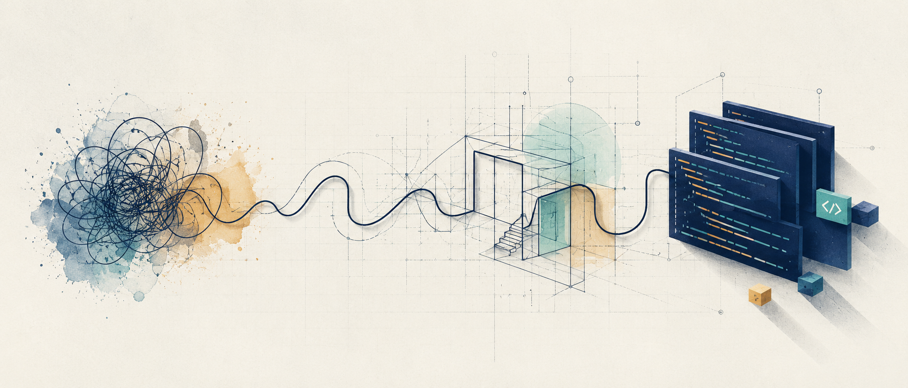
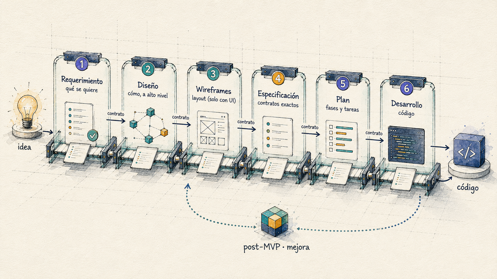
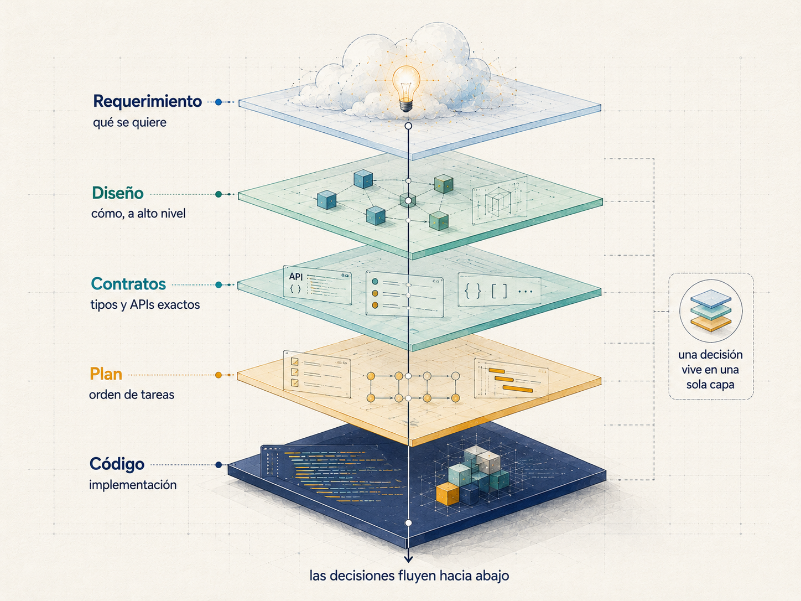
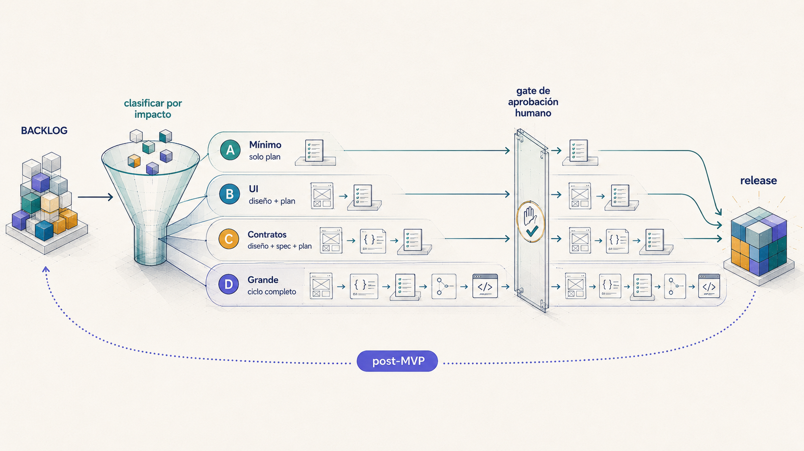

<!--
══════════════════════════════════════════════════════════════════════════════
 IMAGEN 1 · HERO / BANNER  (ancho completo, arriba de todo)
 Ubicación sugerida: docs/assets/hero.png  → descomentar la línea ![] de abajo
 PROMPT (para Midjourney / DALL·E / Ideogram — en inglés, rinde mejor):
 "Wide hero banner for an AI-assisted software development methodology called
  'Spec-Design'. Clean editorial tech illustration: a single elegant line that
  starts as a loose hand-drawn scribble on the left (a raw idea) and gradually
  transforms, left to right, into crisp geometric blueprint lines and finally
  into neat stacked code blocks on the right. Limited palette: deep indigo,
  teal, warm amber accents on an off-white paper background, subtle blueprint
  grid texture, fine precise linework, soft long shadows. Minimal, premium,
  modern developer-tool aesthetic. No text. 21:9 aspect ratio, high detail."
 Alternativa estilo dibujo: misma idea pero "soft hand-drawn ink-and-watercolor
 sketch, architectural notebook style".
══════════════════════════════════════════════════════════════════════════════
-->
<div align="center">



# 🧭 Spec-Design Harness

**Un harness de desarrollo asistido por IA: de la idea cruda al código, sin que el agente improvise.**

Una cadena de *skills* para Claude Code donde **cada fase produce un artefacto con contrato fijo** que la siguiente consume. El modelo no rellena huecos con inventos: pregunta, documenta y construye sobre decisiones cerradas.


</div>

---

## 🤔 Por qué existe

El desarrollo asistido por IA falla casi siempre por lo mismo: le pides a un agente que construya algo a partir de una idea a medio definir, y el modelo **rellena los huecos con suposiciones plausibles** — un stack que no elegiste, un alcance que no pediste, estructuras de datos inventadas sobre la marcha. El resultado se ve bien hasta que lo lees.

El **Spec-Design Harness** invierte eso. En lugar de saltar de la idea al código, lo lleva por **fases de altitud decreciente** (qué quieres → cómo, a alto nivel → contratos exactos → orden → código). Cada fase es un *skill* que sabe exactamente qué consume y qué produce, y que **pregunta en vez de inventar** cuando algo no está definido.

No es un framework que ejecutas: es una **disciplina operativa** que vive en tus skills de Claude Code.

---

## ✨ Qué lo hace distinto

A diferencia de otras herramientas spec-driven, este harness aporta cinco cosas que rara vez están juntas:

- **🔀 Patrón preguntas → merge (asíncrono).** Cuando falta información, la skill no asume: genera un archivo `preguntas-*.md` con opciones `(a)(b)(c)` y un campo `R:`. Respondes a tu ritmo, y la skill integra (*merge*) tus respuestas al documento. Cero invención.
- **♻️ Ciclo de vida post-MVP.** El harness no termina en el primer release. Un `BACKLOG.md` vivo + el skill `/mejora` iteran cada funcionalidad nueva con **rigor proporcional al impacto** (un toggle no paga la ceremonia de un MVP; un cambio de contrato no entra a código sin spec).
- **✋ Gate humano formalizado.** La documentación nunca fluye a desarrollo autónomo sin tu OK explícito. Está codificado como una *parada de aprobación*, distinta de un menú de opciones.
- **🧠 Memoria trazable.** Una bitácora con referencia cruzada (`B-007 → ADR-2 / RF-5 / tarea F2-T3`) registra el porqué de cada decisión, sobreviviendo entre sesiones.
- **🛡️ Calidad sin perder la disciplina.** Cada skill trae una tabla **anti-racionalización** (excusa → realidad) que desarma los atajos típicos del modelo. Y la calidad transversal (seguridad, accesibilidad, performance, testing) vive como **referencias consultables** + **personas de revisión** (`revisor-codigo`, `auditor-seguridad`) que el gate invoca — opcionales, sin convertir el harness en un catálogo.

<!--
══════════════════════════════════════════════════════════════════════════════
 IMAGEN 2 · DIAGRAMA DEL PIPELINE  (el visual central — va aquí)
 Ubicación sugerida: docs/assets/pipeline.png
 PROMPT (en inglés):
 "Clean isometric technical illustration of a software pipeline drawn as an
  assembly line of connected translucent glass panels, left to right, 8 stations.
  Each station is a distinct labeled module representing a phase of work that
  hands a document to the next. Style: editorial developer-tool aesthetic, thin
  precise linework, limited palette of deep indigo + teal + warm amber on
  off-white, subtle blueprint grid in the background, soft long shadows, gentle
  depth. Leave clear empty space under each station for a caption. No readable
  text inside the art. 16:9, premium, high detail."
 Alternativa dibujo: "hand-drawn architect's notebook diagram, ink lines with
  light watercolor fills, arrows connecting labeled boxes".
══════════════════════════════════════════════════════════════════════════════
-->
## 🌟 El pipeline

<p align="center"></p>

```
/iniciar-harness → 💡 idea
                     │
   1 refinar-requerimiento   → requerimiento limpio (qué se quiere)
   2 documento-diseno        → diseño funcional + técnico (cómo, alto nivel)
   3 wireframes *            → layout y navegación (sin stack)
   4 especificacion-tecnica  → contratos exactos (tipos, APIs, módulos)
   5 plan-implementacion     → plan Fases → Tareas + control
   6 desarrollo              → 💻 código
                     │
                BACKLOG.md → /mejora <id>  (ciclo post-MVP, adaptativo)
```

<sub>\* La fase de wireframes se omite automáticamente si el proyecto no tiene UI (CLI, API, librería).</sub>

| Skill | Rol | Produce |
|-------|-----|---------|
| `iniciar-harness` | arranque (no es fase) | estructura del proyecto, plantillas, perfil (UI/LLM/API), `CLAUDE.md` |
| `refinar-requerimiento` | fase 1 | requerimiento limpio + preguntas |
| `documento-diseno` | fase 2 | diseño funcional + técnico (User Stories + EARS, MoSCoW, FURPS+, ADR) |
| `wireframes` | fase 3 *(con UI)* | wireframes ASCII + mapa de navegación |
| `especificacion-tecnica` | fase 4 | tipos, contratos de API, módulos (secciones condicionales por perfil) |
| `plan-implementacion` | fase 5 | plan Fases → Tareas + archivos de control + `BACKLOG.md` |
| `desarrollo` | fase 6 | código + seguimiento/bitácora |
| `mejora` | ciclo post-MVP | router adaptativo (tracks A/B/C/D) con gate de aprobación humano |

<!--
══════════════════════════════════════════════════════════════════════════════
 IMAGEN 3 · SEPARACIÓN POR ALTITUDES  (junto a la sección "Cómo funciona")
 Ubicación sugerida: docs/assets/altitudes.png
 PROMPT (en inglés):
 "Conceptual illustration of 'separation by altitude' in software design: a
  cross-section of layered horizontal strata, like a clean geological diagram or
  a stack of floating translucent platforms at different heights. Top layer = a
  light cloud / idea; descending layers become progressively more structured:
  wireframe grids, then typed contracts, then an ordered task list, then solid
  code at the bottom. A single thin vertical line connects all layers, showing
  decisions flowing top-down only. Editorial tech style, indigo-teal-amber on
  off-white, fine linework, soft shadows, no text. 4:3, premium, high detail."
══════════════════════════════════════════════════════════════════════════════
-->
## 🧭 Cómo funciona

<p align="center"></p>

El principio rector es la **separación por altitud**: cada decisión vive en una sola fase, y los cambios fluyen *top-down*. Una decisión cerrada nunca se reabre desde una fase posterior — se vuelve a la fase dueña. Así el código no erosiona el diseño, y el diseño no contamina el requerimiento.

Cada skill comparte un esqueleto disciplinado: declara **qué consume** y **qué produce**, una sección explícita de **qué NO hace**, una lista de **anti-patrones**, una tabla de **racionalizaciones** (excusa → realidad) y un **output check** (definition of done) que impide cerrar la fase si algo quedó a medias. Las convenciones compartidas (rutas, IDs, estados, el patrón de preguntas, las referencias de calidad y las personas de revisión) viven en un único `CONVENCIONES.md`, no duplicadas en cada skill.

---

## ⚡ Instalación

### Opción A — Como plugin *(recomendado)*

```bash
# 1. Agregar el marketplace de gianni-labs
/plugin marketplace add gianni-labs/harness-skills-kit

# 2. Instalar el harness
/plugin install spec-design@gianni-labs
```

### Opción B — Instalación manual

Copia las skills a tu proyecto (o a `~/.claude/skills/` para uso global):

```bash
git clone https://github.com/gianni-labs/harness-skills-kit.git
cp -R harness-skills-kit/skills/. tu-proyecto/.claude/skills/
```

> Asegúrate de copiar también la carpeta `skills/_harness/` — contiene las convenciones y plantillas que las skills necesitan.

---

## 🚀 Uso rápido

```bash
# 1. Inicializa el proyecto (crea la estructura, captura el perfil)
/iniciar-harness

# 2. Escribe tu idea en un .md y refínala
/refinar-requerimiento documentacion/01-requerimiento/idea.md

# 3. Avanza fase por fase, respondiendo los preguntas-*.md
/documento-diseno
/wireframes            # se omite solo si no hay UI
/especificacion-tecnica
/plan-implementacion

# 4. Construye
/desarrollo

# 5. Después del MVP, itera desde el backlog
/mejora RF-15
```

En cada fase de diseño, la skill te deja un archivo `preguntas-*.md`. Lo respondes, le avisas, y la skill integra tus respuestas antes de cerrar. Nada avanza sobre suposiciones.

<!--
══════════════════════════════════════════════════════════════════════════════
 IMAGEN 4 · CICLO POST-MVP / RIGOR ADAPTATIVO  (en la sección de mejoras)
 Ubicación sugerida: docs/assets/ciclo-mejoras.png
 PROMPT (en inglés):
 "Illustration of an adaptive improvement loop for software. Center: a circular
  flow arrow returning a finished product (a small built cube) back into a
  funnel. The funnel sorts incoming improvement requests into four lanes of
  increasing rigor, labeled A B C D, each lane visibly longer and more detailed
  than the previous (A = a single short step, D = a full multi-step pipeline).
  A small human-hand 'approval gate' icon sits before the build stage. Editorial
  tech style, indigo-teal-amber on off-white, thin linework, soft shadows, room
  for captions, no readable text. 16:9, premium, high detail."
══════════════════════════════════════════════════════════════════════════════
-->
## ♻️ Después del MVP: mejoras con rigor adaptativo

<p align="center"></p>

El primer release construye el MVP; lo que queda fuera vive en `BACKLOG.md`. El skill `/mejora` toma un ítem y elige **cuánto harness aplicar según el impacto del cambio**:

| Track | Cuándo | Qué documenta |
|-------|--------|---------------|
| **A — Mínimo** | deuda técnica, toggle, refactor | solo `plan.md` |
| **B — UI** | feature visible sin tocar contratos | diseño ligero `+` wireframes `+` plan |
| **C — Contratos** | toca tipos / schema / endpoints / datos | diseño `+` especificación `+` plan |
| **D — Grande** | feature arquitectónica | ciclo completo (mini-MVP) |

Ante la duda entre dos tracks, gana el más riguroso. Cada mejora vive en su propia carpeta como un *delta* que **referencia** el baseline del MVP sin reabrirlo.

---

## 🔬 Comparación con otras herramientas

| | **Spec-Design Harness** | GitHub Spec Kit | AWS Kiro | BMAD Method |
|---|:---:|:---:|:---:|:---:|
| Fases con contrato fijo | ✅ | ✅ | ✅ | ✅ |
| Preguntar en vez de inventar (preguntas→merge) | ✅ | parcial | parcial | ❌ |
| Ciclo de vida post-MVP (rigor adaptativo) | ✅ | ❌ | ❌ | ❌ |
| Gate de aprobación humano formalizado | ✅ | ❌ | ❌ | parcial |
| Memoria con trazabilidad cruzada | ✅ | ❌ | parcial | ❌ |
| Perfil de proyecto (omite fases según UI/LLM/API) | ✅ | ❌ | ❌ | ❌ |

El harness no llega a competir en cobertura de integraciones (Spec Kit soporta decenas de agentes): llega con **disciplina** — el flujo correcto, las paradas correctas y la negativa a improvisar.

*Fuentes:* [github/spec-kit](https://github.com/github/spec-kit) · [Claude Code Plugins](https://code.claude.com/docs/en/plugin-marketplaces)

---

## 📂 Estructura del repo

```
skills/<nombre>/SKILL.md          ← las 8 skills instalables
skills/_harness/CONVENCIONES.md   ← única fuente de lo compartido (rutas, IDs, estados, patrones)
skills/_harness/templates/        ← plantillas (INDICE, BACKLOG, bitácora, seguimiento, CLAUDE…)
skills/_harness/referencias/      ← checklists de calidad (seguridad, accesibilidad, performance, testing)
skills/_harness/agentes/          ← personas de revisión (revisor-codigo, auditor-seguridad)
docs/MANUAL.md                    ← manual del harness (el porqué de cada decisión)
```

## 🗺️ Estado y roadmap

- [x] Las 8 skills, genéricas y desacopladas de cualquier dominio
- [x] Convenciones y plantillas centralizadas
- [x] Skill de arranque (`iniciar-harness`)
- [x] Empaquetado como plugin de Claude Code (`.claude-plugin/marketplace.json`)
- [x] Archivo `LICENSE` (MIT)
- [ ] Proyecto de ejemplo + artefactos dorados (demo end-to-end)

## 🤝 Contribuir

Las propuestas de mejora al harness se discuten en *issues*. Si usas el kit en un proyecto real y encuentras una fricción del flujo, ese feedback es justamente lo que lo hace evolucionar.

## 📄 Licencia

MIT — ver [`LICENSE`](LICENSE).

<!--
NOTA DE MANTENIMIENTO (no publicar / borrar antes de hacer público si se prefiere):
- Idioma: el README está en español por coherencia con el kit (skills, comandos y
  artefactos en español). Para alcance internacional, evaluar un README.en.md espejo.
- Imágenes: 4 placeholders arriba (hero, pipeline, altitudes, ciclo-mejoras) con su
  prompt. Generarlas, guardarlas en docs/assets/ y descomentar la línea ![] de cada una.
  Mantener una sola paleta (indigo / teal / amber sobre off-white) en las 4 para coherencia.
-->
