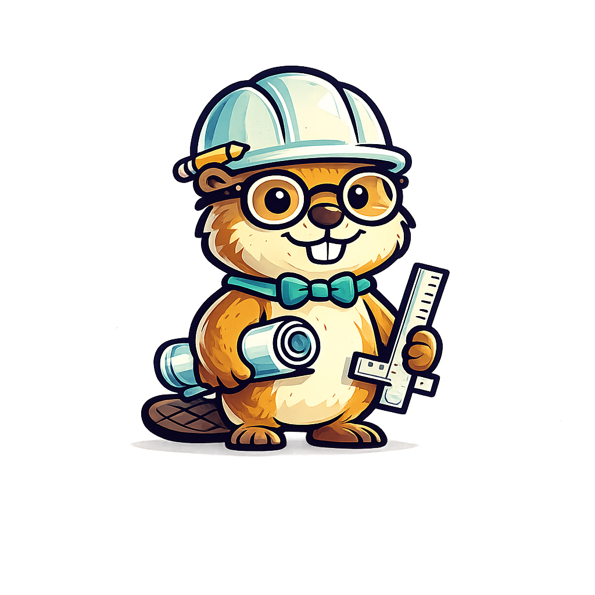

<div align="center">


# 🧭 Spec-Design Harness



**Un harness de desarrollo asistido por IA: de la idea cruda a un MVP sólido —y a las mejoras que vienen después—, sin que el agente improvise.**

Una cadena de *skills* para Claude Code donde **cada fase produce un artefacto con contrato fijo** que la siguiente consume. El modelo no rellena huecos con inventos: pregunta, documenta y construye sobre decisiones cerradas.

[](CHANGELOG.md)


</div>

---

## 🤔 Por qué existe

El desarrollo asistido por IA falla casi siempre por lo mismo: le pides a un agente que construya algo a partir de una idea a medio definir, y el modelo **rellena los huecos con suposiciones plausibles** — un stack que no elegiste, un alcance que no pediste, estructuras de datos inventadas sobre la marcha. El resultado se ve bien hasta que lo lees.

El **Spec-Design Harness** invierte eso. En lugar de saltar de la idea al código, lo lleva por **fases de altitud decreciente** (qué quieres → cómo, a alto nivel → contratos exactos → orden → código). Cada fase es un *skill* que sabe exactamente qué consume y qué produce, y que **pregunta en vez de inventar** cuando algo no está definido.

No es un framework que ejecutas: es una **disciplina operativa** que vive en tus skills de Claude Code.

> ### 🎯 Llega a un MVP, y sigue
>
> El objetivo de la primera pasada es claro: un **MVP funcional**, construido con disciplina y sin alcance inflado. Lo que queda fuera no se pierde — va al `BACKLOG`.
>
> Y ahí está la diferencia: **el harness no termina en el MVP.** Cada mejora posterior entra por el backlog y se construye con **rigor proporcional a su impacto** (un toggle no paga la ceremonia de un MVP; un cambio de contrato no entra sin spec), **reutilizando** lo ya documentado en vez de reescribirlo. El MVP es un hito, no el final.

---

## ✨ Qué lo hace distinto

A diferencia de otras herramientas spec-driven, este harness aporta cinco cosas que rara vez están juntas:

<br>

**🔀 Patrón preguntas → merge (asíncrono).**
Cuando falta información, la skill no asume: genera un archivo `preguntas-*.md` con opciones `(a)(b)(c)` y un campo `R:`. Respondes a tu ritmo, y la skill integra (*merge*) tus respuestas al documento. Cero invención.

<br>

**♻️ Ciclo de vida post-MVP.**
El harness no termina en el primer release. Un `BACKLOG.md` vivo + el skill `/mejora` iteran cada funcionalidad nueva con **rigor proporcional al impacto** (un toggle no paga la ceremonia de un MVP; un cambio de contrato no entra a código sin spec).

<br>

**✋ Gate humano formalizado.**
La documentación nunca fluye a desarrollo autónomo sin tu OK explícito. Está codificado como una *parada de aprobación*, distinta de un menú de opciones.

<br>

**🧠 Memoria trazable.**
Una bitácora con referencia cruzada (`B-007 → ADR-2 / RF-5 / tarea F2-T3`) registra el porqué de cada decisión, sobreviviendo entre sesiones.

<br>

**🛡️ Calidad sin perder la disciplina.**
Cada skill trae una tabla **anti-racionalización** (excusa → realidad) que desarma los atajos típicos del modelo. Y la calidad transversal (seguridad, accesibilidad, performance, testing) vive como **referencias consultables** + **personas de revisión** (`revisor-codigo`, `auditor-seguridad`) que el gate invoca — opcionales, sin convertir el harness en un catálogo.

## 🌟 El pipeline

<p align="center"></p>

<sub>Cada flecha es un **handoff con contrato fijo**: lo que una fase produce es exactamente lo que la siguiente consume. La fase de wireframes se omite sola si el proyecto no tiene UI (CLI, API, librería). El ciclo post-MVP (línea punteada) reaplica solo las fases que el cambio necesita.</sub>

### Las skills, una por una

La cadena de contratos: cada fase **consume** el artefacto de la anterior y **produce** el de la siguiente, sin ambigüedad.

| Etapa | Skill | Consume | Produce |
|-------|-------|---------|---------|
| arranque | `iniciar-harness` | — | estructura, plantillas, perfil (UI/LLM/API), `CLAUDE.md` |
| fase 1 | `refinar-requerimiento` | idea cruda | requerimiento limpio + preguntas |
| fase 2 | `documento-diseno` | requerimiento | diseño funcional + técnico (EARS · MoSCoW · FURPS+ · ADR) |
| fase 3 *(con UI)* | `wireframes` | §Vistas + §Flujos | wireframes ASCII + mapa de navegación |
| fase 4 | `especificacion-tecnica` | diseño + wireframes | tipos, contratos de API, módulos (condicional por perfil) |
| fase 5 | `plan-implementacion` | especificación | plan Fases → Tareas + control + `BACKLOG.md` |
| fase 6 | `desarrollo` | plan + contratos | código + seguimiento/bitácora |
| post-MVP | `mejora` | `BACKLOG.md` | router adaptativo (tracks A/B/C/D) + gate humano |

## 🧭 Cómo funciona

<p align="center"></p>

El principio rector es la **separación por altitud**: cada decisión vive en una sola fase, y los cambios fluyen *top-down*. Una decisión cerrada nunca se reabre desde una fase posterior — se vuelve a la fase dueña. Así el código no erosiona el diseño, y el diseño no contamina el requerimiento.

Cada skill comparte un esqueleto disciplinado: declara **qué consume** y **qué produce**, una sección explícita de **qué NO hace**, una lista de **anti-patrones**, una tabla de **racionalizaciones** (excusa → realidad) y un **output check** (definition of done) que impide cerrar la fase si algo quedó a medias. Las convenciones compartidas (rutas, IDs, estados, el patrón de preguntas, las referencias de calidad y las personas de revisión) viven en un único `CONVENCIONES.md`, no duplicadas en cada skill.

---

## 🧪 Validado en la práctica

El harness se probó **end-to-end** sobre un proyecto real: de una idea en una frase a un **MVP funcional verificado**, en una sola corrida. La separación por fases evitó el sobre-diseño (una base de datos completa quedó correctamente diferida al backlog en vez de colarse al MVP), y la especificación técnica dio contratos suficientes para construir sin rediseñar a mitad de camino.

<p align="center"></p>

📖 **[Lee el caso de estudio completo →](docs/CASO-ESTUDIO.md)** — el recorrido fase por fase, con diagramas y capturas del MVP construido.

---

## ⚡ Instalación

### Opción A — Como plugin *(recomendado)*

```bash
# 1. Agregar el marketplace de gianni-labs
/plugin marketplace add gianni-labs/harness-skills-kit

# 2. Instalar el harness
/plugin install spec-design@gianni-labs
```

### Opción B — Instalación manual

Copia las skills a tu proyecto (o a `~/.claude/skills/` para uso global):

```bash
git clone https://github.com/gianni-labs/harness-skills-kit.git
cp -R harness-skills-kit/skills/. tu-proyecto/.claude/skills/
```

> Asegúrate de copiar también la carpeta `skills/_harness/` — contiene las convenciones y plantillas que las skills necesitan.

---

## 🚀 Uso rápido

```bash
# 1. Inicializa el proyecto (crea la estructura, captura el perfil)
/iniciar-harness

# 2. Escribe tu idea en un .md y refínala
/refinar-requerimiento documentacion/01-requerimiento/idea.md

# 3. Avanza fase por fase, respondiendo los preguntas-*.md
/documento-diseno
/wireframes            # se omite solo si no hay UI
/especificacion-tecnica
/plan-implementacion

# 4. Construye
/desarrollo

# 5. Después del MVP, itera desde el backlog
/mejora RF-15
```

En cada fase de diseño, la skill te deja un archivo `preguntas-*.md`. Lo respondes, le avisas, y la skill integra tus respuestas antes de cerrar. Nada avanza sobre suposiciones.

## ♻️ Después del MVP: mejoras con rigor adaptativo

<p align="center"></p>

El primer release construye el MVP; lo que queda fuera vive en `BACKLOG.md`. El skill `/mejora` toma un ítem y elige **cuánto harness aplicar según el impacto del cambio**:

| Track | Cuándo | Qué documenta |
|-------|--------|---------------|
| **A — Mínimo** | deuda técnica, toggle, refactor | solo `plan.md` |
| **B — UI** | feature visible sin tocar contratos | diseño ligero `+` wireframes `+` plan |
| **C — Contratos** | toca tipos / schema / endpoints / datos | diseño `+` especificación `+` plan |
| **D — Grande** | feature arquitectónica | ciclo completo (mini-MVP) |

Ante la duda entre dos tracks, gana el más riguroso. Cada mejora vive en su propia carpeta como un *delta* que **referencia** el baseline del MVP sin reabrirlo.

---

## 🔬 Dónde encaja

> **No es un catálogo de buenas prácticas; es la disciplina que las pone en orden.** La mayoría de las herramientas del género son colecciones de prácticas activables o pipelines sin estado. Este harness es lo otro: un **orquestador con contratos y memoria** que decide *qué fase, en qué orden, con qué parada* — y se niega a improvisar.

| | **Spec-Design Harness** | GitHub Spec Kit | AWS Kiro | BMAD Method | agent-skills |
|---|:---:|:---:|:---:|:---:|:---:|
| Fases con contrato fijo (handoff sin ambigüedad) | ✅ | ✅ | ✅ | ✅ | ❌ |
| Preguntar en vez de inventar (preguntas→merge async) | ✅ | parcial | parcial | ❌ | parcial |
| Ciclo de vida post-MVP (rigor adaptativo) | ✅ | ❌ | ❌ | ❌ | ❌ |
| Gate de aprobación humano formalizado | ✅ | ❌ | ❌ | parcial | parcial |
| Memoria con trazabilidad cruzada | ✅ | ❌ | parcial | ❌ | ❌ |
| Perfil de proyecto (omite fases según UI/LLM/API) | ✅ | ❌ | ❌ | ❌ | ❌ |
| Estado persistente y reanudable en disco | ✅ | parcial | ✅ | ❌ | ❌ |
| Cobertura horizontal de calidad (testing/sec/perf…) | referencias | ❌ | ❌ | parcial | ✅ |

La última fila es la honesta: en **cobertura horizontal de prácticas**, una biblioteca como [`agent-skills`](https://github.com/addyosmani/agent-skills) es más amplia. Por eso este harness **no compite ahí** — la incorpora como *referencias* y *personas de revisión*, y se queda con lo que nadie del género hace tan completo: el **flujo correcto, las paradas correctas y la trazabilidad de cada decisión**.

> Dicho de otro modo: `agent-skills` (y similares) responden *"¿qué práctica aplico?"*; este harness responde *"¿en qué orden, con qué contratos, con qué memoria, y qué pasa después del MVP?"*. Son **complementarios** — el harness es la capa que organiza prácticas como esas, no otra colección de ellas.

*Fuentes:* [github/spec-kit](https://github.com/github/spec-kit) · [addyosmani/agent-skills](https://github.com/addyosmani/agent-skills) · [Claude Code Plugins](https://code.claude.com/docs/en/plugin-marketplaces)

---

## 📂 Estructura del repo

```
harness-skills-kit/
├── skills/
│   ├── <fase>/SKILL.md        # las 8 skills instalables — una por fase del pipeline
│   └── _harness/              # lo compartido (nunca duplicado en una skill)
│       ├── CONVENCIONES.md    #   única fuente: rutas, IDs, estados, patrón preguntas→merge
│       ├── templates/         #   plantillas que las skills copian al proyecto destino
│       ├── referencias/       #   checklists de calidad (seguridad, accesibilidad, performance, testing)
│       └── agentes/           #   personas de revisión (revisor-codigo, auditor-seguridad)
├── docs/MANUAL.md             # el porqué del harness (principios, fases, ciclo de vida)
├── docs/CASO-ESTUDIO.md       # prueba empírica end-to-end (idea → MVP) con capturas
└── .claude-plugin/            # manifiesto para instalar como plugin de Claude Code
```

Dos ideas guían la organización: **una fase = una skill = un artefacto**, y **todo lo compartido vive en `_harness/`** (las skills lo referencian, no lo copian).

## 🤝 Contribuir

Las propuestas de mejora al harness se discuten en *issues*. Si usas el kit en un proyecto real y encuentras una fricción del flujo, ese feedback es justamente lo que lo hace evolucionar.

## 📄 Licencia

MIT — ver [`LICENSE`](LICENSE).
