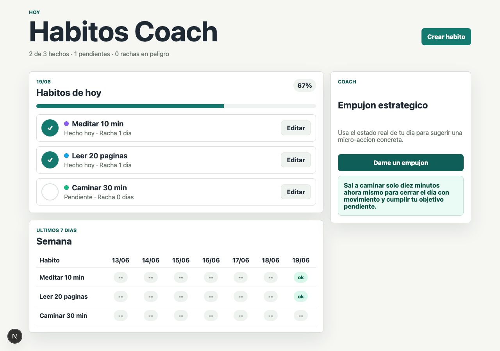
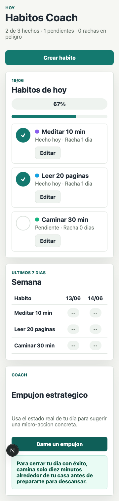

# Caso de estudio: de la idea cruda al MVP con el harness

> Prueba empírica del harness Spec-Design ejecutada **end-to-end** sobre un proyecto
> real: **Habitos Coach**, una app para crear hábitos con un coach asistido por LLM.
> El objetivo no era la app, sino **validar el harness**: ¿lleva una idea vaga hasta
> código funcional sin perderse por el camino?
>
> Resultado corto: **sí**. Una sola corrida, idea → MVP funcional verificado.

<p align="center"></p>

<sub>El MVP real construido por el harness, con datos de ejemplo. El panel **Coach** muestra una **sugerencia generada en vivo por el LLM** (botón "Dame un empujón") a partir del estado del día; el endpoint tiene fallback si el proveedor falla. La vista de semana y el registro diario son los RF del MVP. La persistencia es `localStorage` (Supabase quedó en el backlog como RF-8).</sub>

---

## La idea, en una frase

```
  "Una app donde la gente crea hábitos y un coach con IA
   les ayuda a mantenerlos."
```

Eso es todo lo que había al empezar. Sin stack, sin alcance, sin pantallas. El
trabajo del harness es convertir *eso* en código sin inventar lo que falta.

---

## El recorrido por las fases

Cada caja es una fase. Cada fase **produce** un artefacto que la siguiente
**consume** sin ambigüedad. Nadie reabre una decisión ya cerrada.

```
  IDEA CRUDA
     │
     ▼
  ┌─────────────────────┐   "¿qué se quiere, exactamente?"
  │ 1 · Requerimiento   │ ─────────────────────────────────►  requerimiento.md
  └─────────────────────┘   RF-1..N, RNF, criterios            (qué, no cómo)
     │
     ▼
  ┌─────────────────────┐   "¿cómo, a alto nivel?"
  │ 2 · Diseño          │ ─────────────────────────────────►  diseno.md + ADRs
  └─────────────────────┘   vistas, flujos, stack, decisiones
     │
     ▼
  ┌─────────────────────┐   "¿cómo se ve?"  (perfil con UI)
  │ 3 · Wireframes      │ ─────────────────────────────────►  wireframes.md
  └─────────────────────┘   ASCII + mapa de navegación
     │
     ▼
  ┌─────────────────────┐   "¿contra qué contrato programo?"
  │ 4 · Especificación  │ ─────────────────────────────────►  especificacion-tecnica.md
  └─────────────────────┘   tipos, endpoints, JSON, errores
     │
     ▼
  ┌─────────────────────┐   "¿en qué orden?"
  │ 5 · Plan            │ ─────────────────────────────────►  plan.md (tareas F-N·T-M)
  └─────────────────────┘   tareas con dependencias            + BACKLOG.md
     │
     ▼
  ┌─────────────────────┐   "a construir, tarea por tarea"
  │ 6 · Desarrollo      │ ─────────────────────────────────►  CÓDIGO + bitácora
  └─────────────────────┘   gate de review/verify por fase
     │
     ▼
  MVP FUNCIONAL ✅
```

---

## El momento clave: cómo el harness evitó el sobre-diseño

Esta es la lección central del experimento. Una IA sin disciplina, al oír "coach con
IA y datos de usuarios", **mete una base de datos y autenticación en el día 1**. El
harness no la dejó, porque cada decisión tiene una fase dueña y un destino claro:

```
        "Necesito guardar hábitos de usuarios..."
                        │
        ┌───────────────┴───────────────┐
        ▼                               ▼
   ¿es del MVP?                    ¿es alcance futuro?
        │                               │
   persistencia                    Supabase/Postgres
   simple: localStorage            cuenta + sync multi-dispositivo
        │                               │
        ▼                               ▼
   ┌─────────────┐               ┌──────────────────────┐
   │  EN EL MVP  │               │  BACKLOG → RF-8       │
   │  (se hace)  │               │  Track C (post-MVP)   │
   └─────────────┘               └──────────────────────┘

   Resultado: MVP entregado HOY, con la mejora grande ya
   capturada y lista para retomar — no perdida, no improvisada.
```

> **Por qué funcionó:** la separación por altitud (requerimiento ≠ diseño ≠ código)
> y el `BACKLOG.md` como cola viva. El alcance que no entra **no se descarta en
> silencio ni se cuela al vuelo**: se registra con un ID y un track.

---

## Qué construyó, en concreto

```
  Stack            Next.js (App Router)
  Persistencia     localStorage (MVP)  ──► RF-8: Supabase queda en backlog
  IA               endpoint server-side /api/coach
                   con FALLBACK si falta API key o el proveedor falla
  Perfil           UI ✅   LLM ✅   API ✅
```

El detalle del **fallback del LLM** salió de la especificación técnica (fase 4): el
contrato definía qué pasa cuando el proveedor no responde, así que el código no tuvo
que improvisarlo. *La spec previene el "¿y si falla?" de último minuto.*

---

## La verificación (el gate no se saltó)

Antes de declarar "terminado", el desarrollo cerró su gate con evidencia, no con
"se ve bien":

```
  [✓] lint            [✓] typecheck        [✓] tests
  [✓] build           [✓] audit (deps)     [✓] navegador desktop
  [✓] responsive 360px (mobile)            [✓] fallback del LLM probado
```

<p align="center"></p>

<sub>El mismo MVP a 360px: el layout responde al breakpoint objetivo verificado en el gate.</sub>

---

## Qué funcionó mejor (lecciones)

| Lo que pasó | Por qué importa |
|-------------|-----------------|
| La separación por fases evitó meter Supabase en el MVP. | El sobre-diseño es el error #1 de un agente sin disciplina. La altitud lo previene. |
| El patrón **preguntas → merge** hizo explícitas las decisiones abiertas. | Nada se "inventó": lo dudoso se preguntó y quedó registrado. |
| La especificación técnica dio contratos suficientes. | El código no tuvo que rediseñar a mitad de camino. |
| El `BACKLOG.md` con RF-8 dejó la mejora Supabase lista como Track C. | El alcance diferido no se pierde: se retoma con `/mejora`. |

---

## Reproducir esto

```
  /iniciar-harness          ← crea estructura + captura perfil (UI/LLM/API)
  /refinar-requerimiento    ← idea cruda → RFs
  /documento-diseno         ← RFs → diseño + ADRs
  /wireframes               ← (si hay UI)
  /especificacion-tecnica   ← diseño → contratos
  /plan-implementacion      ← contratos → tareas ordenadas
  /desarrollo               ← tareas → código, con gate por fase
```

> Más sobre el *porqué* de cada fase: [`MANUAL.md`](MANUAL.md).
> La app construida vive como ejemplo independiente (fuera de este repo, para
> mantener el kit genérico y sin dominio).
