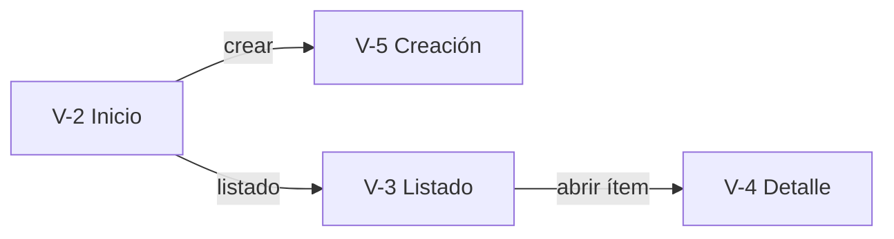

# wireframes

Tercera fase de la metodología Spec-Design (convenciones compartidas: `CONVENCIONES.md` del harness):

```
[requerimiento cerrado]  →  2 documento-diseno
                                  ↓
                            [diseño]  →  3 wireframes (este skill)  →  [wireframes ASCII + mapa de navegación]
                                                  ↓
                            4 especificacion-tecnica → 5 plan-implementacion → 6 desarrollo → código
```

> **Fase condicional:** esta fase aplica solo a proyectos **con UI** (perfil del proyecto, `CONVENCIONES.md` §8). Si el proyecto no tiene UI (CLI, API, librería), la fase **se omite**: marcarla como "— omitida" en `INDICE.md` y pasar directo a `/especificacion-tecnica`.

El objetivo es validar **layout de cada pantalla** y, sobre todo, el **orden y las secuencias de navegación** entre ellas, con el artefacto más barato de iterar posible: **texto**. No hay clic, no hay build, no hay framework. Se trabaja en markdown, vive junto al diseño y se itera en segundos.

---

## ⚠️ Regla de oro: este skill NO define stack

Este skill produce **layout y navegación, nada más**. No implica, sugiere ni prepara ninguna decisión de tecnología.

- **No** escribe React, Vue, HTML real, CSS ni código de ningún framework.
- **No** elige ni insinúa framework, librería de UI, router ni build tool.
- La decisión de stack vive **exclusivamente** en el diseño técnico (`diseno-tecnico.md`, ADR de framework) y **no se toca aquí**.
- Si el usuario pide "hazlo en React/Next/HTML para ya verlo funcionando", **resistir**: eso es la fase de código, no esta. Recordar que el valor de esta fase es iterar el orden y la secuencia sin comprometer tecnología.

El artefacto de salida debe incluir, visible, este disclaimer.

---

## Qué consume (contrato de entrada)

Del documento de diseño cerrado (por defecto `diseno.md`):

- **§Pantallas / Vistas (V-N)** — fuente principal. Cada V-N ya trae: propósito, datos que muestra, acciones del usuario, RFs que cubre, flujos a los que pertenece, y estado inicial/vacío.
- **§Flujos (F-N)** — para construir el mapa de navegación y las secuencias.
- **§RNF de usabilidad/diseño** (ej. "minimalista", "mobile-first si se definió") — para fijar la intención de layout, sin entrar en pixeles.

> Si una V-N del diseño no tiene datos suficientes para bocetarla, **no inventar**: anotar la duda en `preguntas-wireframes.md`.

---

## Qué hace este skill

1. Lee el diseño cerrado (`diseno.md` o el indicado).
2. Produce (por defecto) en `documentacion/03-wireframes/`:
   - `wireframes.md` — una pantalla ASCII por cada V-N + el mapa de navegación + las secuencias por flujo.
   - `preguntas-wireframes.md` — dudas de layout/navegación para refinar.
3. Espera respuestas del usuario en `preguntas-wireframes.md`.
4. Integra las respuestas en `wireframes.md`.
5. Actualiza el `INDICE.md` de la documentación.
6. Cierra y deja listo el handoff a la fase de plan de implementación / código.

## Qué este skill NO hace

- **No define stack** (ver regla de oro).
- **No escribe código real** ni componentes; solo cajas ASCII y diagramas mermaid.
- **No agrega pantallas** que no salgan de una V-N del diseño. Si emerge una pantalla nueva necesaria, va a `preguntas-wireframes.md` (puede implicar un hueco en §Pantallas del diseño).
- **No diseña UI fina**: nada de colores, tipografías, spacing en px, iconografía. Solo estructura y jerarquía.
- **No inventa lógica de negocio**: los datos mostrados son ilustrativos/mock, anotados como tales.
- **No prioriza ni estima**: eso es del plan de implementación.

---

## Fase 0: Aclaraciones iniciales

Antes de tocar archivos, confirmar **en un solo mensaje breve**:

1. **Archivo de diseño fuente:** ruta exacta (por defecto `documentacion/02-diseno/diseno.md`).
2. **Orientación de layout:** mobile-first, desktop, o ambos. **Derivar del RNF de responsive del diseño**; si no está definido, preguntar — sin asumir un default.
3. **Alcance:** ¿solo las vistas del MVP (Must) o todas las V-N incluidas las post-MVP? Por defecto: **solo MVP**.
4. **Resumen de qué se va a hacer** en 3–4 viñetas.

No empezar hasta tener la confirmación.

> **Modo directo** (`CONVENCIONES.md` §9): si la skill fue invocada por el orquestador `mejora` o el usuario pasó `directo`, anunciar fuentes y defaults en un mensaje y proceder sin esperar confirmación.

---

## Fase 1: Generar wireframes + mapa de navegación

### Estructura objetivo de `wireframes.md`

```
1. Encabezado + disclaimer "no define stack"
2. Convenciones de notación ASCII
3. Mapa de navegación global (mermaid)
4. Secuencias por flujo (F-N → orden de pantallas)
5. Wireframes por pantalla (V-N)        ← una caja ASCII por vista
6. Pendientes de wireframe
```

### Notación ASCII (convención del skill)

Declarar al inicio del documento para que todas las cajas se lean igual:

```
[ Botón ]            acción / CTA
‹ ›                  navegación (anterior/siguiente)
[___]                campo de entrada
[Sí/No] [▾]          selector / dropdown
( ) ( )              radio / toggle
☐ ☑                  checkbox
⚠                    aviso / alerta contextual
· item               item de lista
─── ───              separador de sección
{mock}               dato ilustrativo (no real)
→ RF-N / F-N         anotación de trazabilidad
```

### Formato de wireframe por pantalla (V-N)

```markdown
### V-N: [Nombre de la pantalla]
> Cubre: RF-X, RF-Y · Flujos: F-A, F-B · Layout: mobile/desktop

​```
┌─ V-N: Nombre ──────────────────────────────┐
│  [estructura ASCII de la pantalla]          │
│  ...                                        │
└─────────────────────────────────────────────┘
​```

**Anotaciones:**
- [elemento] → qué dato muestra / qué acción dispara (RF-N).

**Estados:**
- Vacío: descripción.
- Loading: descripción (si aplica).
- Error: descripción (si aplica).

**Navega hacia:** V-X (al hacer [acción]), V-Y (al hacer [acción]).
```

> Cada pantalla debe terminar declarando **a qué otras pantallas navega y con qué acción** — eso es lo que alimenta el mapa y las secuencias.

### Mapa de navegación global (mermaid)

Un único `flowchart` que conecte todas las V-N del alcance, con las aristas etiquetadas por la acción o el flujo que produce la transición. Es la vista de "orden de pantallas" de un golpe.



### Secuencias por flujo (F-N)

Para cada flujo del diseño, listar el **orden de pantallas** que recorre (esto es el corazón de lo que el usuario quiere validar):

```markdown
**F-3 [Nombre del flujo]:** V-2 → V-5 → (éxito) V-3 / (error) V-5
```

Usar un `sequenceDiagram` o `flowchart` solo si el flujo tiene ramas que no se entienden en una línea.

### Reglas por sección

- **§5 Wireframes:** cubrir **todas las V-N del alcance**. Cada caja refleja los "Datos que muestra" y "Acciones" declarados en la V-N del diseño — ni más ni menos.
- **Estados:** incluir vacío/loading/error cuando la V-N los mencione o cuando sean evidentes (ej. pantalla que depende de una llamada al LLM → loading + error).
- **Datos mock:** marcarlos como `{mock}`. No inventar reglas de negocio detrás.
- **Trazabilidad:** toda caja referencia sus RF-N y F-N. Una pantalla sin RF asociado es señal de over-design → revisar contra el diseño.

### Reglas para `preguntas-wireframes.md`

Formato canónico en **`CONVENCIONES.md` §5**. Deltas de esta fase:

- Máximo ~12 preguntas.

Bloques sugeridos:
- Ambigüedades de layout (qué va primero, qué se agrupa).
- Dudas de navegación (¿desde dónde se llega a X? ¿hay vuelta atrás?).
- Estados no especificados en el diseño (qué mostrar en vacío/error).
- Pantallas que parecen faltar (posible hueco en §Pantallas del diseño → marcar con ⚠️).

---

## Fase 2: Merge de respuestas

1. Leer respuestas en `preguntas-wireframes.md`.
2. Integrar en las cajas ASCII / mapa / secuencias correspondientes.
3. Si una respuesta revela una pantalla faltante, **no agregarla por cuenta propia al diseño**: avisar que la V-N debería existir en `diseno.md` primero (el diseño es la fuente de verdad de qué pantallas hay).
4. Limpiar §Pendientes de wireframe.
5. Reformular, no copiar literal.

---

## Fase 3: Cierre + handoff

Al terminar, generar un resumen en el chat:

```
✅ Wireframes cerrados.

- Pantallas bocetadas: V-1, ..., V-N
- Mapa de navegación: N transiciones
- Secuencias cubiertas: F-1, ..., F-M
- Recordatorio: este artefacto NO define stack (decisión sigue en diseno-tecnico.md, ADR de framework).

Listo para: plan de implementación / código.
```

**Archivar** `preguntas-wireframes.md` (integrado) en `03-wireframes/_archivo/` — automático, según `CONVENCIONES.md` §5, sin preguntar. Actualizar `INDICE.md` con el estado de la fase 3.

---

## Modo mejora (scoped)

Cuando este skill se invoca dentro del **track de mejoras post-MVP** (orquestado por el skill `mejora`), solo aplica **si la mejora agrega pantallas nuevas**:

- **Escribe en** `documentacion/mejoras/<id>-<slug>/wireframes.md`, **no** en `03-wireframes/`.
- **Alcance = solo las pantallas nuevas** (las V-N que el diseño de la mejora introdujo), más cómo se enganchan al **mapa de navegación existente** (que se referencia, no se rehace).
- Si la mejora no agrega pantallas (solo cambia comportamiento de una existente), este skill **se omite** en el track: el cambio se describe en el `diseno.md` de la mejora.
- Sigue sin definir stack (regla de oro intacta).

---

## Manejo de casos especiales

**El usuario pide "hazlo en React/HTML para verlo funcionando".**
Resistir. Recordar la regla de oro: esta fase valida orden y secuencia en texto, sin comprometer stack. Un prototipo clickeable es otra fase (o el código real, que requiere el plan de implementación primero). Si insiste, dejar registrado que es decisión suya y que rompe el desacople de fases — pero el output por defecto de este skill sigue siendo ASCII.

**Una V-N del diseño está incompleta para bocetarla.**
No rellenar inventando datos o acciones. Anotar en `preguntas-wireframes.md` qué falta de esa V-N.

**Aparece una pantalla necesaria que no está en el diseño.**
Marcar con ⚠️ en `preguntas-wireframes.md`: "Esto sugiere una V-N faltante en diseno.md — confirmar para agregarla al diseño antes de bocetarla."

**El diseño cambió después de hacer los wireframes.**
Re-derivar las cajas afectadas desde la V-N actualizada. El diseño manda.

---

## Anti-patrones a evitar

- ❌ Escribir React/HTML/CSS o cualquier código de framework (rompe la regla de oro).
- ❌ Insinuar o decidir stack, router, librería de componentes.
- ❌ Inventar pantallas que no tienen V-N en el diseño.
- ❌ Inventar datos o reglas de negocio reales (todo dato es `{mock}`).
- ❌ Diseñar UI fina: colores hex, fuentes, spacing en px.
- ❌ Cajas ASCII que no referencian sus RF-N / F-N.
- ❌ Mapa de navegación "decorativo" que no refleja las transiciones reales declaradas en las pantallas.
- ❌ Pantallas sin transiciones de salida (no se sabe a dónde se navega → secuencia incompleta).

---

## Output check (definition of done)

El wireframe está cerrado cuando se cumple **todo**:

- [ ] Toda V-N del alcance tiene su caja ASCII.
- [ ] Cada caja referencia sus RF-N y F-N y declara a dónde navega.
- [ ] Existe un mapa de navegación global que conecta todas las pantallas del alcance.
- [ ] Cada flujo (F-N) del diseño tiene su secuencia de pantallas explícita.
- [ ] El documento incluye el disclaimer "no define stack".
- [ ] No hay código de framework ni decisiones de stack en el artefacto.
- [ ] No quedan `(?)` ni dudas sin resolver dentro del alcance.

Si algún check falla, el skill no termina — vuelve a la fase de preguntas.
